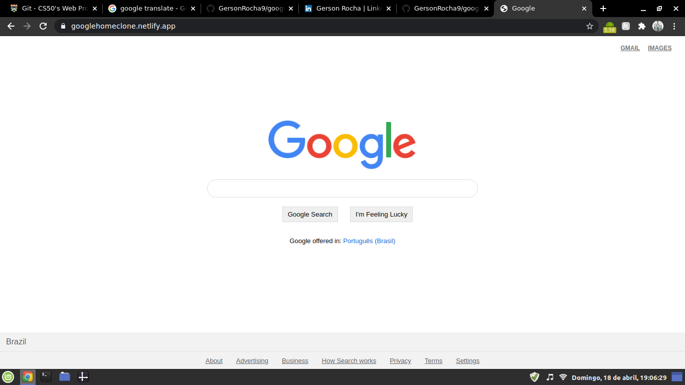

<!-- PROJECT LOGO -->
 

  

  <h3 align="center">Google Clone</h3>

  

    Google HomePage Clone Project for the Harvard edX CS50 Web Programming Program.
     

<!-- ABOUT THE PROJECT -->
## About The Project

In this clone of the homepage, only HTML and CSS were used for the creation and stylization of the project.

All buttons work with their respective official Google links, including the Google Search button and the I'm Feeling Lucky button.

### Built With

* HTML
* CSS

<!-- LICENSE -->
## License

Distributed under the MIT License. See `LICENSE` for more information.

<!-- CONTACT -->
## Contact

Gerson Rocha - [LinkedIn](https://linkedin.com/in/gersonrocha) - gersonrocha9@gmail.com

Project Link: [https://github.com/GersonRocha9/googleClone](https://github.com/GersonRocha9/googleClone)
